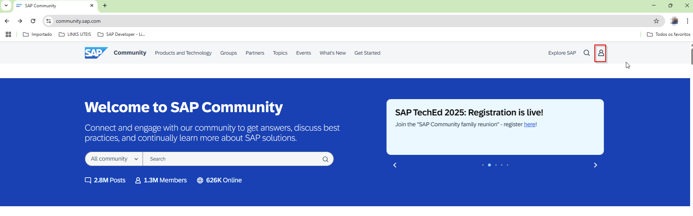
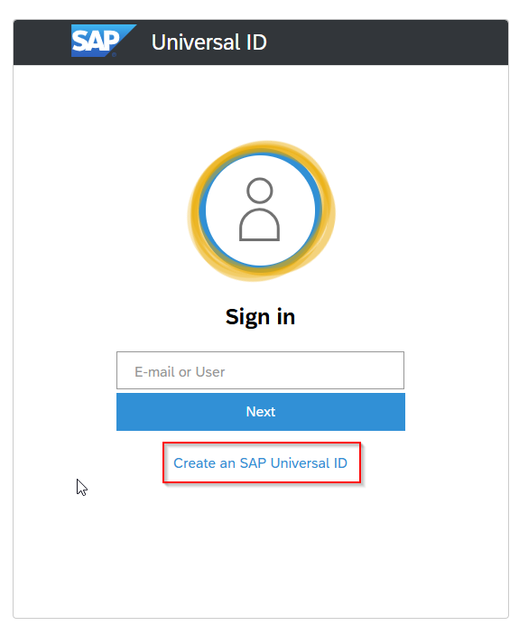
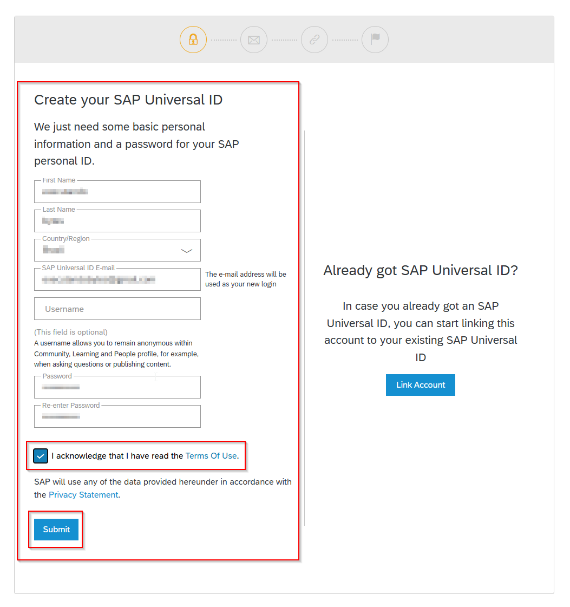
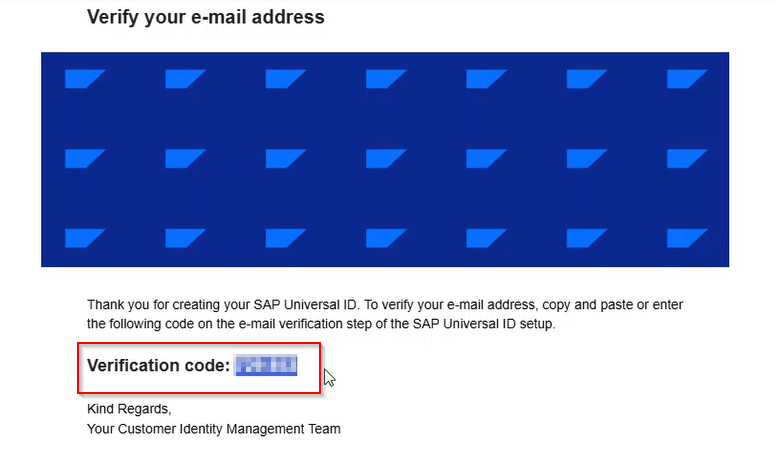
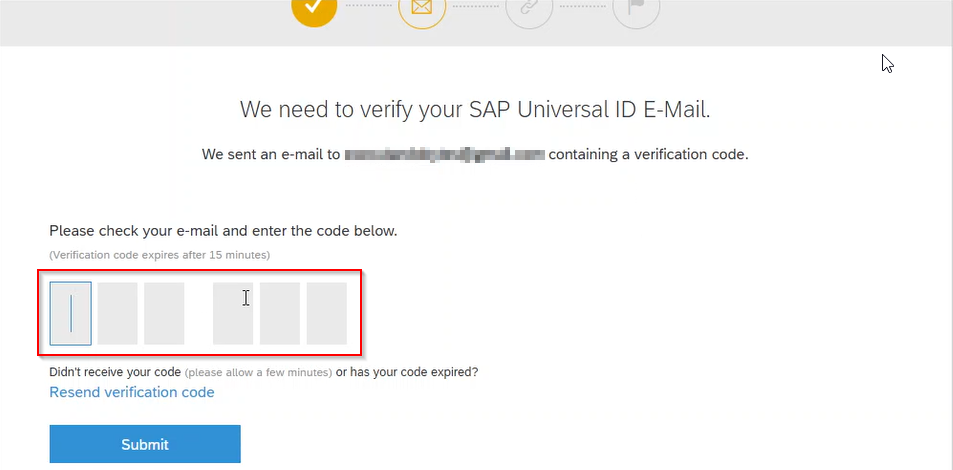
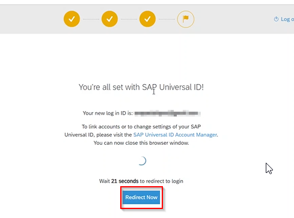
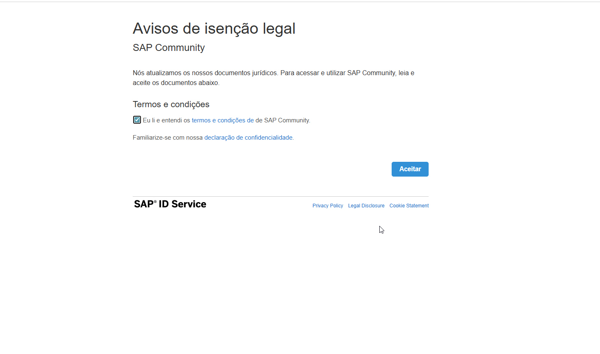
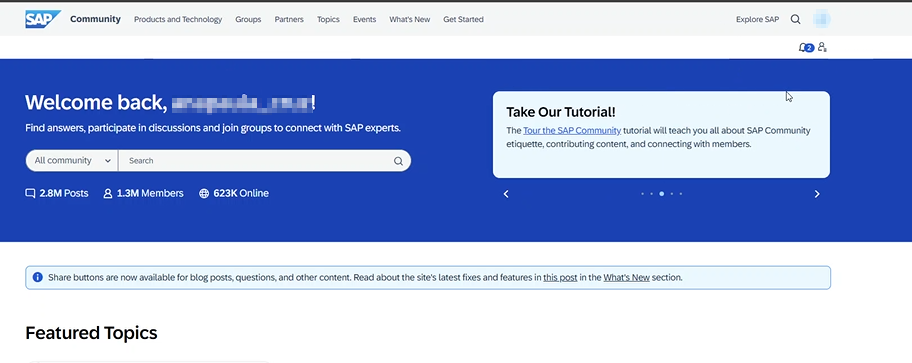

## Neste passo, iremos acessar a página inicial para a geração da conta *SAP Universal ID*

1 - Acesse [SAP Community](community.sap.com/).

2 - Na tela inicial apresentada, click no ícone destacado na imagem. 

3 - A tela *SAP Universal ID* é apresentada. Nela temos as seguintes opções:
- No campo texto existente, a entrada dos dados *E-Mail or User* indica a entrada do *SAP Universal ID* (caso este procedimento ocorreu anteriormente), essas informações devem ser inseridas. Na sequencia, bastar clicar em *Next* para proceguir com o login.

- Ou no nosso contexto, iremos escolher a opção com o click no botão *Create an SAP Universal ID* para inciarmos o processo de geração de um novo *SAP Universal ID*
  

4 - Conforme destacado na imagem, preencha todas as informações necessárias na área *Create your SAP Universal ID*. Não esqueça de marcar a opção do checkbox *"I acknowledge that I have read the Terms Of Use."*, e na sequencia, click em *Submit* para iniciar o processo de geração do novo *SAP Universal ID*

5 - Submetidas as informações pessoais, a seguinte tela solicitando a entrada de um código de validação, enviado no e-mail informado, durante o cadastro para a geração do *SAP Universal ID*, é requisitado. Check o e-mail iformado, copie e cole o código de verificação nos campos de entradas correspondentes as quantidades de caracteres contidos neste código de verificação. Submeta esta checagem, com o click no botão *Submit*.

*E-Mail enviado pelo serviço de geração do SAP Universal ID, contendo o código de validação*

*Tela do navegador (browser), para entrada do código de validação*

6 - Na tela seguinte é confirmado a execução das etapas para geração do *SAP Universal ID*. Apenas click no botão *Redirect Now* para proceguir.

7 - A próxima tela, apresenta o termos legais para utilização do serviço. *Check* o campo de *checkbox* para concordar com os termos de utilização, e click no botão *Aceitar*.

8 - Finalizado todos os passos anteriores, a seguinte tela é apresentada. É realizado um direcionamento para a página inicial do *[SAP Community](https://community.sap.com/)*, exibindo o *logon* com as credenciais geradas durante o processo de criação do *SAP Universal ID*. Com este último passo alcançado, concluímos aqui todo os passos e realização dos procedimentos necessários para geração do *SAP Universal ID*.

- [Avance para: Passo 2 - Utilizando o SAP Universal ID, para consumir um serviço SAP OData (Parte 1)](../step-02/README.md)
- [Retorne para: Página inicial](../README.md)