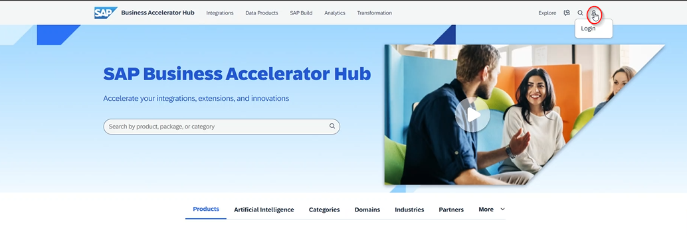
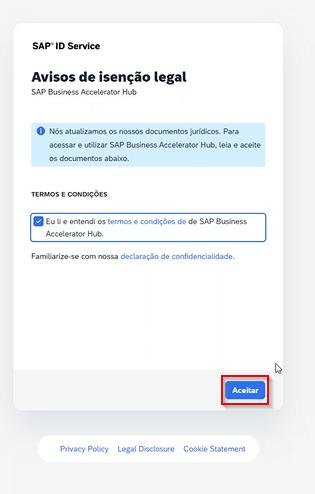
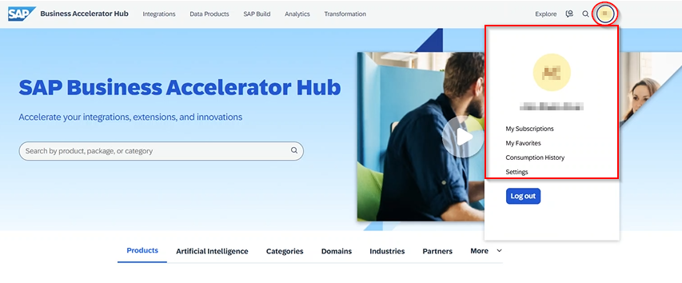
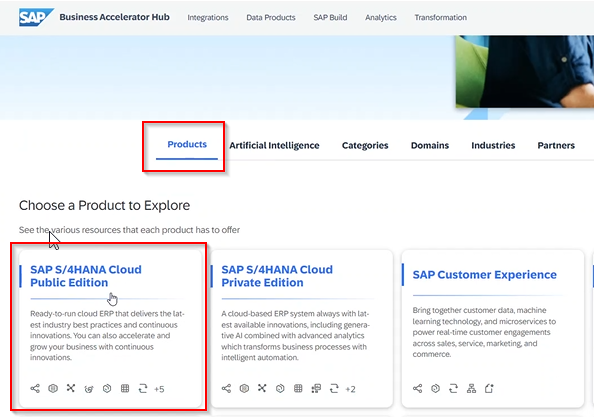
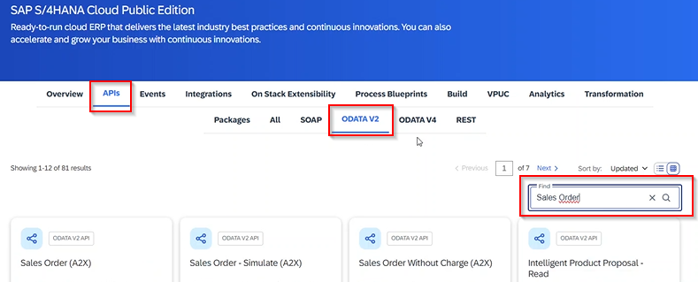

## Neste passo, iremos Utilizar o *SAP Universal ID*, para consumir um serviço SAP OData no *[SAP Business Accelerator Hub](https://api.sap.com/)*

1 - Acesse [SAP Business Accelerator Hub](https://api.sap.com/)

2 - Click no ícone com símbolo de um *Avatar (Usuário)*, localizado no canto superior direito da tela, e na sequencia, click no submenu suspenso *Login*.

3 - Na próxima tela apresentada, click no campo checkbox, aceitando os termos de utilização do serviço e em seguida click no botão *Aceitar*.

4 - A tela inicial do *SAP Business Accelerator Hub* será apresentada novamente, contendo os dados de login do usuário, sendo apresentado no canto superior direito da tela.

5 - No submenu *Products*, click no title (Atalho) *SAP S/4HANA Cloud Public Edition*

6 - Na página *SAP S/4HANA Cloud Public Edition*, navegue para subtela *APIs*. Dentro da subtela *APIs* selecione a opção *ODATA V2*. Na opção *ODATA V2* entre com o valor *"Sales Order"* no campo *Find*. Tecle *Enter* ou click no ícone de *Lupa* contido no campo *Find*, esta ação filtra as opções de *Tiles (Atalhos)* de serviços OData disponíveis em um ambiente sandbox para testes, prototipação e aprendizado, disponibilizado pela SAP.

- [Retorne para: Página inicial](../README.md)