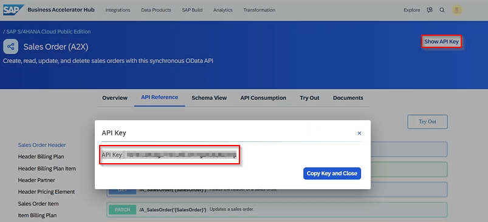

## Neste passo, iremos Utilizar o *SAP Universal ID*, para consumir um serviço SAP OData no *[SAP Business Accelerator Hub](https://api.sap.com/)* via *[POSTMAN](https://www.postman.com/downloads/)*

1 - Com o serviço *Sales Order*, localizado e posicionado mediante a seleção do *atalho (Title)* descrito no passo anterior, na plataforma *[SAP Business Accelerator Hub](https://api.sap.com/)*, navegue até o canto superior direito da tela, e clique no botão *Show API Key*. Este botão exibe o valor da *API Key*, vinculado ao *SAP Universal ID* logado na plataforma. Esta *API Key* é utilizada para o consumo dos serviços OData V2 disponíveis para o consumo.

2 - Caso não tenha app *POSTMAN* instalado no equipamento, acesse *[POSTMAN](https://www.postman.com/downloads/)*. Siga as instruções do assistente de instalação, conclua o processo de instalação que é bem simples e intuitivo, para utilização do app nos próximo passos deste tópico.

3 - Com o app *POSTMAN* devidamente instalado e configurado e a chave *API Key* em mãos, execute o app *POSTMAN* e crie uma nova requisição de serviços.
- No canto superior esquerdo, selecione o menu "Collections", e na sequencia clique no botão *New*;

  
- Na tela de pop-up apresentada, selecione a opção *Collections*;

  
- Informe uma descrição desejada, para nova coleção de requisição criada;

  
- No canto direito na mesma linha da descrição da *Collections* criada, clique no botão com ícone *"3 pontinhos" (...)*, no menu suspenso selecione a opção *Add folder* e entre com uma descrição desejada, para nova pasta criada dentro da *Collections*;

  
- No canto direito na mesma linha da descrição da *folder* criada, clique no botão com ícone *"3 pontinhos" (...)*, no menu suspenso selecione a opção *Add request* e entre com uma descrição desejada, para nova requisição criada dentro da *folder*;

4 - Com a nova requisição criada, entre as seguintes configurações para a chamada do serviço OData V2

- No campo *ComboBox* em destaque, selecione o método GET *(Método já selecionado por padrão ao criar uma nova requisição)*. Entre com o valor da *URL* no campo *TextBox* localizado ao lado do campo *ComboBox*, para seleção dos métodos de requisições de serviços;

| URL Modelo                                             | URL Configurada                                                                      | Service_Name        | End_Point    | Predicate |
| :----------------------------------------------------: | :----------------------------------------------------------------------------------: | :-----------------: | :----------: | :--------:|
| https://{host}:{port}/sap/opu/odata/sap/{Service_Name} | https://sandbox.api.sap.com/s4hanacloud/sap/opu/odata/sap/{Service_Name}/{End_Point} | API_SALES_ORDER_SRV | A_SalesOrder | ?$top=5   |

5 - Configurando uma nova *URL*:
- Entre com os seguintes parâmetros na *URL*, conforme apresentado na imagem a seguir;
- Configure a *URL* para a chamada de serviço OData V2 como desejado;
- Utilize a *URL Modelo* como base, subistituindo os valores como destacado, gerando uma nova *URL configurada* para utilização conforme o exemplo:
  - Subistitua *{host}:{port}* por *sandbox.api.sap.com/s4hanacloud*;
  - Subistitua *{Service_Name}* por *API_SALES_ORDER_SRV*;
  - Subistitua *{End_Point}* por *A_SalesOrder*;
  - Opcional: 
    - Subistitua *{Predicate}* por *?$top=5*. É recomentado o uso deste predicado, como *boas práticas*, para que a requisição não retorne todas as *ordens de vendas* do ambiente sandbox (lembrando que estamos em ambiente testes e prototipação);
  - Resultado *https://sandbox.api.sap.com/s4hanacloud/sap/opu/odata/sap/API_SALES_ORDER_SRV/A_SalesOrder?$top=5*

Onde:
- *sandbox.api.sap.com/s4hanacloud* é host que aponta para o ambiente sandbox disponibilizado na plataforma, para consumo dos serviços OData V2;

6 - Na subtela *Headers* entre com os seguintes valores para a requisição:

| Key             | Value            |
|:----------------|:-----------------|
| Accept          | application/json |
| Accept-Language | pt-br            |
| Content-Type    | application/json |
| apikey          | {Api_Key_Value}  |

Onde:
- *{Api_Key_Value}* é o valor da *API Key*, vinculada ao *SAP Universal ID* logado na plataforma, para o ambiente sandbox disponibilizado, para consumo dos serviços OData V2;
  
7 - Estando todas as configurações em conformidade, execute a requisição com click no botão *Send* e o seguinte resultado é apresentado com sucesso mediante a apresentação do status *200 OK*.

- [Retorne para: Página inicial](../README.md)